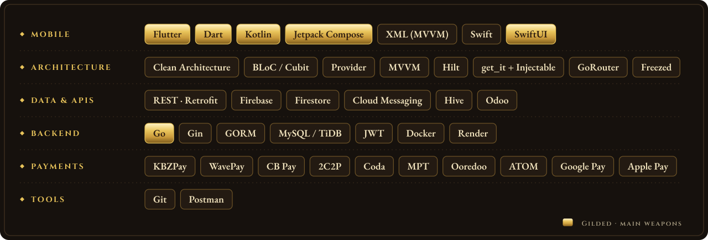

  

  
  &nbsp;
  

## 📜 The Chronicle

**Hail, traveller!** I'm Kaung, a Senior Mobile Developer from Yangon, Myanmar, forging apps for Android and iOS.

- ⚔️ Leading a **four-person mobile team** at **UMG Group of Companies**, through code reviews, mentoring and training
- 🏰 **6 apps** in production on Google Play and the App Store, including **ShweStream** with **50,000+ downloads**
- 💰 **10 payment gateways** integrated, from KBZPay and WavePay to Google Pay and Apple Pay
- 🔨 Forging **SurveyNext**: a Go REST API with native Android (Jetpack Compose) and iOS (SwiftUI) apps
- 🛡️ Weapon of choice: **Flutter** with **Clean Architecture** and **BLoC**

## 🏆 Hall of Deeds

  

## ⚔️ The Armoury

  

## 🏰 Realms Served

Apps I've built and maintained that are live in the stores today.

| App | Realm | What it does | Get it |
| :-- | :-- | :-- | :-- |
| **Hi5** | UMG Group | The group's HR platform on Odoo: meetings, training, library and assets | [Google Play](https://play.google.com/store/apps/details?id=com.umg.cid.hi5) · [App Store](https://apps.apple.com/us/app/hi5-umg/id6751432064) |
| **Win Finance** | UMG Group | Loan management: approvals, disbursement and instalment tracking | [Google Play](https://play.google.com/store/apps/details?id=com.umg.cid.winfinance) |
| **BeTheFirst Internet** | UMG Group | ISP self-service: plans, payments and support tickets | [Google Play](https://play.google.com/store/apps/details?id=com.umg.cid.bethefirst) · [App Store](https://apps.apple.com/th/app/bethefirst-internet/id6749923238) |
| **ShweStream** | E-trade Myanmar | Movie streaming with 50,000+ downloads | [Google Play](https://play.google.com/store/apps/details?id=com.etm.shwestreammyanmar) · [App Store](https://apps.apple.com/mm/app/shwestream-movies/id1532865417) |
| **Byoh Lifestyle** | E-trade Myanmar | Daily lifestyle videos, articles and programmes | [Google Play](https://play.google.com/store/apps/details?id=com.etm.smyouth) · [App Store](https://apps.apple.com/th/app/byoh-lifestyle/id6670603719) |
| **Soon Loon Global** | Freelance client | E-commerce for heavy-machinery spare parts | [Google Play](https://play.google.com/store/apps/details?id=com.soonloonglobal.app) · [App Store](https://apps.apple.com/mm/app/soon-loon-global/id6790389209) |

## 🗺️ Quests

### 🛡️ SurveyNext · full-stack survey platform

Interviewers build, publish and analyse surveys; respondents answer them and earn points; admins keep the realm in order.

| | Forged with | Repository |
| :-- | :-- | :-- |
| **Backend** | Go · Gin · GORM · TiDB · JWT roles · Docker on Render | [Survey-Backend](https://github.com/Gen-LJ/Survey-Backend) |
| **Android** | Kotlin · Jetpack Compose · Hilt · Retrofit · StateFlow | [Survey-Next-CMP](https://github.com/Gen-LJ/Survey-Next-CMP) |
| **iOS** | Swift · SwiftUI · async/await · Keychain | [Survey-Next-iOS](https://github.com/Gen-LJ/Survey-Next-iOS) |

### 📯 Survey Spark · Flutter and Firebase

A two-sided survey and rewards app: interviewers publish and analyse, respondents answer and earn points, all synced in real time through Firestore.

`Flutter` `BLoC` `Clean Architecture` `Firebase` `GoRouter` `fl_chart` → [Survey-Spark](https://github.com/Gen-LJ/Survey-Spark)

### 🪙 LedgerL · Flutter and Firebase

A peer-to-peer wallet where every transfer is guarded by an atomic Firestore transaction, with offline viewing and a responsive design system.

`Flutter` `BLoC` `Clean Architecture` `Firebase` `GoRouter` → [LedgerL](https://github.com/Gen-LJ/LedgerL)

## 🐉 The Dragon's Trail

  <picture>
    <source media="(prefers-color-scheme: dark)" srcset="https://raw.githubusercontent.com/Gen-LJ/Gen-LJ/output/dragon-dark.svg">
    <source media="(prefers-color-scheme: light)" srcset="https://raw.githubusercontent.com/Gen-LJ/Gen-LJ/output/dragon-light.svg">
    
  </picture>

  <i>🪶 Send a raven to <a href="mailto:kaungljoy@gmail.com">kaungljoy@gmail.com</a>, or summon me on <a href="https://www.linkedin.com/in/kaung-l-joy/">LinkedIn</a>.</i>
   
  ⚜️ Forged in Yangon, Myanmar ⚜️

